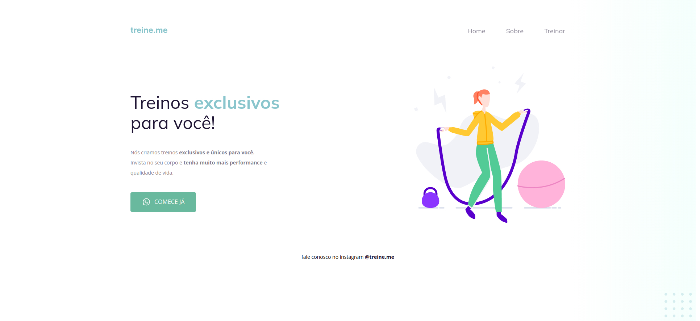

  

## 🧪 Tecnologias

Desafio do Stage 02 do curso Explorer da Rocketseat utilizando as seguintes tecnologias:

- HTML
- CSS

Nesse desafio , a estrutura do HTML foi utilizando tags semânticas para o desenvolvimento do site.